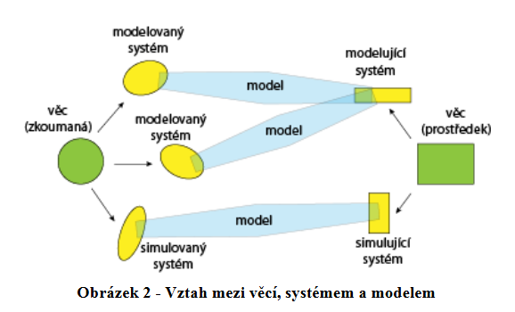
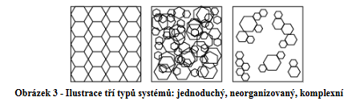
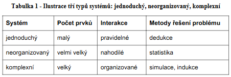
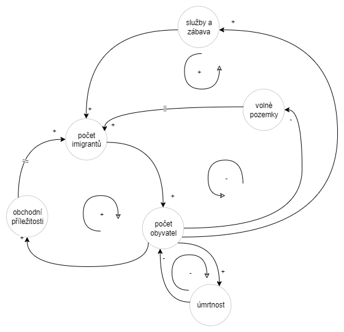

## 2. Základní pojmy

### Systém
Abstrakce, která zanedbává některé aspekty studovaného objektu hmotného světa. Aspekty, ktere zbývají jsou daným oborem zvládnutelné.

Dochazí k zanedbání vlastností,které nejsou proo řešený problém důležité.

**Statický systém** - abstrahuje se čas
**Dynamický systém** - čas se nezanedbává, má časovou existenci
**Časová existence** - množina okamžiků, v nichž systém existuje
**Stav systému** - vlastnost systému pro každý okamžik existence
**Událost** - změna stavu systému
**Prvek systému** - složka systému
**Transakce** - prvek systému, který může do systému vstupovat a opouštět
**Permanentní prvky = aktivity** - existují v systému po celou jeho dobu existence
**Atributy prvků** - vlastnosti prvků systému = *standardní* a relace mezi prvky = *referenční*
**Struktura** - stav referenčních atributu sprvků systému

### Model
Model je vztah mezi dvěma systémy *modelujícím* a *modelovaným*.

Každému prvku $P$ modelovaného je přiřazen prvek $Q$ modelujícího
V simulaci se uplatňují pouze **simulační modely = modely dynamické**

Jejich modelující i modelované systémy jsou dynamické systémy. 

Existuje zobrazení **$τ$** existence modelovaného systému do existence modelujícího systému;  je-li tedy **$t_1$** okamžik, v němž existuje modelovaný systém **$M_1$**, je mu přiřazen  okamžik **$τ(t_1) = t_2$**, v němž existuje modelující systém **$M_2$**, a tak je zobrazením **$τ$** přiřazen i stavu **$S_1(t_1) = σ_1$** systému **$M_1$** stav **$S_2(t_2) = σ_2$** systému **$M_2$**.

### Simulátor
simulátor = simulační model = simulující systém

### Modelování
Podstatou modelování ve smyslu výzkumné techniky je náhrada zkoumaného systému jeho modelem  (přesněji: systémem, který jej modeluje), jejímž cílem je získat pomocí pokusů s modelem informaci o původním zkoumaném systému.

### Simulace
Simulace je výzkumná technika, jejíž podstatou je náhrada zkoumaného dynamického systému jeho simulátorem s tím, že se  simulátorem se experimentuje s cílem získat informace o původním zkoumaném dynamickém systému.

***spojitá*** - hdonoty se v čase mění jen spojitě
***diskrétní*** - nenastávají spojité změny v čase
***kombinované*** - kombinace

**Pozor na emulaci** = pouhá náhrada zkoumaného systému, nesloužící k žádným experimentům

### Verifikace
ověření funčknosti modelu, že to běhá

### Validace
ověření pravdivosti modelu, že to reflektuje chování "věci"

### Simulační program
program, který řídí výpočet při simulaci

### Simulační pokus
experiment se simulačním modelem

### Simulovaný čas
není totéž co realný čas, může běžet rychleji nebo pomaleji, důležité je zachování posloupnosti

## 3. Komplexní systémy
systém jako vzájemně propojené části, které spolu interagují tak, že není snadné je separovat

### Emergence
vlastnosti systému mohou být výsledkem interakcí mezi komponentami systému, které tyto vlastnosti nemají, tím vzniká na globální úrovni nový fenomén, to se nazývá **emergence**

### Složitost systému
zvyšuje se s množstvím jeho komponent, interakcí mezi nimi a složitostí samotných elementů a složitostmi interakcé

neexistuje metrika pro rozhodnutí, zda je systém komplexní nebo jednoduchý

v dynamických systémech nelze provádět optimalizace z důvodu zpětnovazebních smyček

### Charakteristiky komplexních systémů
**Řád** - samoorganizace
**Emergence** - viz výše

**Období klidu**
**Období velkých změn**
**Adaptace**

***Pozor na lineární uvažování***

**Zpětná vazba**

## 4. Matematické prostředky pro modelování a simulaci

**Množiny a transformace**
**Fuzzy množiny**
**Lineární algebra** - hlavně modely rozvoje populace
**Diferenční rovnice** - popis změn v dizkrétních časových úsecích
**Diferenciální rovnice** - popis spojitých časových změn

### Pohybové rovnice

### Kvalitativní teorie diferenciálních rovnic
při dtudiu dynamiky systému popsaného pohybovou rovnicí nepotřebujeme znát obecné řešení, ale stačí jen **kvalitativní informace** o chování systému v ustálených režimech => informace tohoto typu poskytuje tato teorie

### Bifurkace

### Thomova teorie katastrof

### Kompartmentové modely

### Metoda GUHA

### Matematická statistika

### Regresní analýza

### Korelační analýza

### Analýza časových řad

### Shluková analýza

### Formální jakzyky a automaty

### Modely založené na agentech
eeee
4 typy agentů:
- 