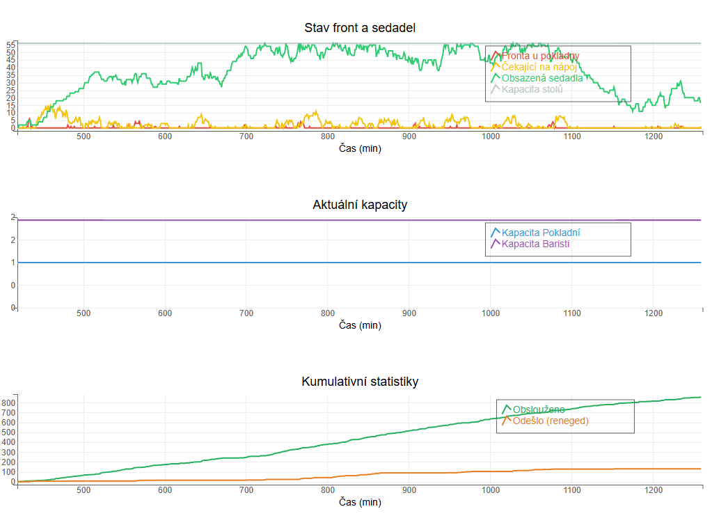

# SIMULAČNÍ MODEL PROVOZU KAVÁRNY

**Semestrální práce z předmětu Modelování a simulace (MOSIM/XMOSM)**

---

**Autor:** Michal Šeda  
**Ročník:** 2024/2025  
**Datum:** 23. ledna 2026  
**Instituce:** Ostravská univerzita v Ostravě

---

## OBSAH

1. [Úvod](#1-úvod)
2. [Teoretický základ](#2-teoretický-základ)
3. [Popis modelovaného systému](#3-popis-modelovaného-systému)
4. [Implementace](#4-implementace)
5. [Experimenty a výsledky](#5-experimenty-a-výsledky)
6. [Závěr](#6-závěr)
7. [Literatura](#literatura)
8. [Přílohy](#přílohy)

---

## 1. ÚVOD

### 1.1 Popis problému

Provoz moderní kavárny představuje komplexní systém hromadné obsluhy, ve kterém dochází k interakci mezi zákazníky, obsluhujícím personálem a omezenými zdroji (pokladna, baristé, kávovary, trouby, sedadla). Majitelé kaváren čelí výzvě optimalizovat svůj provoz tak, aby maximalizovali spokojenost zákazníků při minimalizaci provozních nákladů.

Klíčové otázky, které provozovatelé kaváren řeší:
- Kolik zaměstnanců potřebuji v různých denních časech?
- Jaká je optimální kapacita míst k sezení?
- Kolik zákazníků odchází kvůli dlouhým frontám?
- Kde vznikají úzká místa v procesu obsluhy?

### 1.2 Cíl práce

Cílem této práce je vytvořit **diskrétní simulační model provozu kavárny**, který umožní:

1. **Analyzovat** současný provoz kavárny a identifikovat úzká místa
2. **Experimentovat** s různými konfiguracemi zdrojů (počet baristů, pokladních, stolů)
3. **Optimalizovat** kapacity zdrojů pro různé denní období
4. **Předpovídat** vliv změn v příchodech zákazníků na kvalitu obsluhy

### 1.3 Motivace pro použití simulace

Simulace je vhodným nástrojem pro studium tohoto systému z následujících důvodů:

- **Složitost interakcí**: Chování systému vzniká komplexní interakcí náhodných příchodů, různých typů zákazníků, sdílených zdrojů a časově proměnných kapacit
- **Nákladnost experimentů**: Testování změn v reálném provozu by bylo nákladné a riskantní
- **Stochastický charakter**: Příchody zákazníků, doba obsluhy i chování zákazníků jsou náhodné procesy
- **Optimalizační potřeby**: Potřeba najít optimální konfiguraci pro různé provozní scénáře

### 1.4 Struktura práce

Práce je strukturována následovně:
- **Kapitola 2** poskytuje teoretický základ z oblasti systémů hromadné obsluhy a diskrétní simulace
- **Kapitola 3** popisuje modelovaný systém kavárny včetně koncepčního modelu
- **Kapitola 4** detailně popisuje implementaci modelu v jazyce Python s použitím knihovny SimPy
- **Kapitola 5** prezentuje experimentální výsledky a jejich analýzu
- **Kapitola 6** shrnuje dosažené výsledky a navrhuje budoucí rozšíření

---

## 2. TEORETICKÝ ZÁKLAD

### 2.1 Systémy hromadné obsluhy

#### 2.1.1 Definice

Systémy hromadné obsluhy (anglicky *queuing systems*) jsou systémy, ve kterých dochází k procesům obsluhy mezi zákazníky a obsluhujícími centry. Charakteristickým znakem těchto systémů je existence **front** – uspořádaných seznamů čekajících prvků.

Podle Janoška a Farany (2016) se systém hromadné obsluhy skládá z následujících základních prvků:

1. **Transakce** – pohyblivé entity systému (v našem případě zákazníci)
2. **Facility** – prvek schopný obsloužit nejvýše jednu transakci najednou (např. pokladna)
3. **Sklad** (*storage*) – prvek s kapacitou větší než 1, schopný obsloužit více transakcí současně (např. stoly)
4. **Fronty** – uspořádané seznamy čekajících transakcí, obvykle pracující v režimu FIFO (*First In, First Out*)

#### 2.1.2 Kendallova klasifikace

Systémy hromadné obsluhy se klasifikují podle Kendallovy notace **A/S/c/K/N/D**, kde:

- **A** – rozdělení příchodů (M = Markovovo/exponenciální, D = deterministické, G = obecné)
- **S** – rozdělení doby obsluhy
- **c** – počet obslužných míst (serverů)
- **K** – kapacita systému (maximální počet zákazníků)
- **N** – velikost populace zdrojů
- **D** – disciplína fronty (FIFO, LIFO, PRI, SIRO)

Náš systém lze aproximovat jako **M/G/c/K** s různými hodnotami *c* pro různé typy zdrojů.

#### 2.1.3 Režimy obsluhy

Kromě základního režimu FIFO existují další způsoby obsluhy:

- **LIFO** (*Last In, First Out*) – poslední příchozí je obsloužen první
- **PRI** (*Priority*) – podle přiřazené priority
- **SIRO** (*Selection In Random Order*) – náhodné pořadí

V našem modelu používáme primárně režim **FIFO**, ale skupiny mají **atribut trpělivosti (*patience*)**, který umožňuje opuštění fronty při překročení čekací doby.

### 2.2 Diskrétní simulace

#### 2.2.1 Diskrétní dynamický systém

Podle Janoška a Farany (2016) je **diskrétní dynamický systém** systém, jehož stav se mění pouze v diskrétních časových okamžicích. Tyto okamžiky nazýváme **událostmi**.

Formálně můžeme diskrétní dynamický systém definovat jako:
- **S** – množina stavů systému
- **T** – množina časových okamžiků
- **f: S × T → S** – přechodová funkce

V našem modelu jsou události například:
- Příchod skupiny zákazníků
- Zahájení obsluhy u pokladny
- Dokončení přípravy položky
- Uvolnění stolu

#### 2.2.2 Kalendář událostí

Pro správnou synchronizaci diskrétní simulace používáme **kalendář událostí** – datovou strukturu obsahující všechny naplánované události seřazené podle času jejich výskytu.

Základní operace s kalendářem:
1. **Plánování události** – vložení nové události s časem výskytu
2. **Výběr události** – vyjmutí nejbližší události
3. **Aktualizace času** – posunutí simulačního času na čas vybrané události

#### 2.2.3 Generování pseudonáhodných čísel

Stochastický charakter systému vyžaduje generování náhodných čísel z různých rozdělení:

1. **Exponenciální rozdělení** – pro příchody zákazníků (Poissonův proces)
   ```
   X ~ Exp(λ)
   P(X > t) = e^(-λt)
   ```

2. **Log-normální rozdělení** – pro doby obsluhy, velikosti skupin
   ```
   X ~ LogNormal(μ, σ)
   ln(X) ~ Normal(μ, σ)
   ```

3. **Bernoulliho rozdělení** – pro binární rozhodnutí (chce stůl? nebo chce druh položky?)
   ```
   X ~ Bernoulli(p)
   P(X = 1) = p
   ```

### 2.3 Klíčové metriky výkonnosti

Pro vyhodnocení systému hromadné obsluhy sledujeme následující metriky:

1. **Využití zdrojů** (ρ) – poměr času, kdy je zdroj obsazen
   ```
   ρ = λ / (c × μ)
   ```
   kde λ je intenzita příchodů, c je počet serverů, μ je intenzita obsluhy

2. **Průměrná délka fronty** (L_q) – průměrný počet čekajících zákazníků

3. **Průměrná doba čekání** (W_q) – průměrná doba strávená ve frontě

4. **Podíl ztracených zákazníků** – procento zákazníků, kteří odešli bez obsluhy

---

## 3. POPIS MODELOVANÉHO SYSTÉMU

### 3.1 Popis kavárny

#### 3.1.1 Provozní doba a časové intervaly

Kavárna je v provozu **14 hodin denně** (7:00 – 21:00 = 420–1260 minut). Provozní den je rozdělen do **pěti časových intervalů** s odlišnými charakteristikami příchodů zákazníků:

| Interval | Čas | Popis | Příchody/hod |
|----------|-----|-------|--------------|
| 1 | 7:00 – 10:00 | Ranní špička | 60 |
| 2 | 10:00 – 12:00 | Dopoledne | 30 |
| 3 | 12:00 – 14:00 | Polední nápor | 50 |
| 4 | 14:00 – 18:00 | Odpoledne | 40 |
| 5 | 18:00 – 21:00 | Večerní klid | 20 |

> Samotné nastavení je ale předmětem konfigurace a lze ji měnit v konfiguračním souboru.

#### 3.1.2 Typy zákazníků

Model rozlišuje **pět typů zákazníků** s různým chováním:

**1. Ranní spěchající do práce**
- Velikost skupiny: průměr 1 osoba (individuální zákazníci)
- Požadavek na stůl: 5% (většina odchází s sebou)
- Trpělivost: nízká (cca 0.6 min)
- Rychlost konzumace: 0.75× (spěchají)
- Objednávky: primárně nápoje

**2. Dopolední maminka**
- Velikost skupiny: průměr 2 osoby (s dětmi)
- Požadavek na stůl: 90% (chtějí si sednout)
- Trpělivost: vyšší (cca 2 min)
- Rychlost konzumace: 5× (zdržují se)
- Objednávky: nápoje + občerstvení

**3. Důchodce**
- Velikost skupiny: průměr 2 osoby (páry)
- Požadavek na stůl: 90%
- Trpělivost: vysoká
- Rychlost konzumace: 5× (zdržují se dlouho)
- Objednávky: primárně nápoje

**4. Zaměstnanec po obědě**
- Velikost skupiny: průměr 2 osoby
- Požadavek na stůl: 90%
- Trpělivost: střední
- Rychlost konzumace: 1× (normální)
- Objednávky: převážně nápoje

**5. Nakupující**
- Velikost skupiny: průměr 2 osoby
- Požadavek na stůl: 70%
- Trpělivost: střední
- Rychlost konzumace: 1× (normální)
- Objednávky: nápoje

### 3.2 Koncepční model

#### 3.2.1 Entity systému

Model obsahuje následující entity:

**Dynamické entity (transakce):**
- **Zákazníci** – jednotlivci tvořící skupiny
- **Skupiny** – kolekce zákazníků pohybujících se společně systémem

**Statické entity (zdroje):**
- **Pokladní** (facility) – kapacita 1-4 podle denní doby
- **Baristé** (facility) – kapacita 1-4 podle denní doby
- **Kávovary** (sklad) – kapacita 1-4
- **Trouby** (sklad) – kapacita 1-4
- **Stoly typ 1** (sklad) – 0-10 stolů × 4 až 20 míst
- **Stoly typ 2** (sklad) – 0-10 stolů × 4 až 20 míst

#### 3.2.2 Atributy entit

**Atributy skupiny:**
- `size` – počet osob ve skupině (1–8)
- `patience` – maximální doba čekání ve frontě (v minutách)
- `wants_table` – požadavek na místo k sezení (boolean)
- `consumption_modifier` – koeficient rychlosti konzumace (0.4–5.0)
- `customer_type_id` – typ zákazníka (1–5)

**Atributy individuálního zákazníka:**
- `order` – seznam objednaných položek (list of item_id)
- `consumption_time` – čas konzumace (minuty)

#### 3.2.3 Procesy systému

**Hlavní proces skupiny zákazníků:**

```
1. PŘÍCHOD
   ↓
2. GENEROVÁNÍ PARAMETRŮ SKUPINY
   - Velikost skupiny
   - Trpělivost (pro frontu na pokladnu)
   - Požadavek na stůl
   - Modifikátor konzumace
   ↓
3. CHCE STŮL?
   ├─ NE → pokračuj na krok 4
   └─ ANO → JSOU VOLNÉ STOLY?
       ├─ NE → RENEGED (odchází BEZ objednávky)
       └─ ANO → OBSAZENÍ STOLŮ (okamžitě)
   ↓
4. ČEKÁNÍ VE FRONTĚ NA POKLADNU (s timeoutem = patience)
   ├─ Timeout → UVOLNĚNÍ STOLŮ (pokud obsazené) → RENEGED
   └─ Obslouženo → pokračuj
   ↓
5. PROCES U POKLADNY
   - Doba = suma časů pro každého člena skupiny
   ↓
6. GENEROVÁNÍ OBJEDNÁVEK
   - Pro každého člena:
     a) Výběr kategorií (Bernoulli s normalizací)
     b) Výběr položek z kategorií
   ↓
7. PŘÍPRAVA OBJEDNÁVEK
   - Pro každou položku:
     a) Sekvenční kroky receptu
     b) Requestování zdrojů (barista, kávovar, trouba)
     c) Čekání na dokončení
     d) Uvolnění zdrojů
   ↓
8. KONZUMACE U STOLU (pokud má stůl a objednávku)
   - Doba = max(časy_zákazníků) × consumption_modifier
   - Stůl je již obsazený od kroku 3
   ↓
9. UVOLNĚNÍ STOLU A ODCHOD
   ↓
10. KONEC (SERVED)
```

**Klíčové vlastnosti tohoto procesu:**

- **Trpělivost (patience)** se vztahuje POUZE k čekání ve frontě na pokladnu
- **Stoly se obsazují PŘED vstupem do fronty** na pokladnu (realistické chování)
- **Dva důvody pro RENEGED:**
  1. Není volný stůl při příchodu (krok 3)
  2. Příliš dlouhá fronta na pokladnu - timeout (krok 4)
- **Stoly se uvolňují** i v případě timeoutu ve frontě (korektní resource management)

**Proces přípravy položky (recept):**

Každá položka má recept složený z kroků. Například **Cappuccino**:

```
Krok 1: Mletí a příprava
  - Zdroje: Barista (1×)
  - Doba: ~0.6 min

Krok 2: Extrakce
  - Zdroje: Kávovar (1×)
  - Doba: ~0.6 min

Krok 3: Šlehání mléka
  - Zdroje: Barista (1×)
  - Doba: ~0.6 min

Krok 4: Výdej
  - Zdroje: Barista (1×)
  - Doba: ~0.6 min
```

#### 3.2.4 Generování objednávek

Proces výběru položek do objednávky:

1. **Výběr kategorií** – Pro každou kategorii aplikujeme Bernoulliho rozdělení:
   ```
   Váhy kategorií: {Nápoj: 0.9, Malé jídlo: 0.3, Velké jídlo: 0.1}
   Normalizace: suma = 1.3
   P(Nápoj) = 0.9/1.3 ≈ 0.69
   P(Malé jídlo) = 0.3/1.3 ≈ 0.23
   P(Velké jídlo) = 0.1/1.3 ≈ 0.08
   
   Bernoulli(0.69) → Ano/Ne pro Nápoj
   Bernoulli(0.23) → Ano/Ne pro Malé jídlo
   Bernoulli(0.08) → Ano/Ne pro Velké jídlo
   ```

2. **Pojistka** – Pokud nebyla vybrána žádná kategorie, vybereme kategorii s nejvyšší váhou

3. **Výběr položky z kategorie** – Weighted random choice:
   ```
   Kategorie "Nápoj": {Espresso: 0.7, Cappuccino: 0.3}
   P(Espresso) = 0.7/(0.7+0.3) = 0.7
   P(Cappuccino) = 0.3/(0.7+0.3) = 0.3
   ```

#### 3.2.5 Alokace stolů

Pro skupinu velikosti *n* hledáme optimální kombinaci stolů:

**Algoritmus (greedy):**

```
1. Získej dostupné stoly s volnými místy
2. IF (celková_volná_místa < n) THEN return None
3. Seřaď stoly podle počtu volných míst (sestupně)
4. WHILE (zbývající_místa > 0):
   a) Vezmi další stůl
   b) Použij min(zbývající_místa, volná_místa_u_stolu)
   c) KONTROLA samotáře: Pokud by zbyl 1 člen a stůl má >1 místo,
      vezmi 2 místa (prevence izolace)
5. Request všechna alokovaná místa
```

**Příklad:** Skupina 8 osob, dostupné stoly:
- Stůl A: 4 volná místa
- Stůl B: 3 volná místa  
- Stůl C: 2 volná místa

Alokace: Stůl A (4) + Stůl B (3) + Stůl C (1) = 8 míst

### 3.3 Pojmový model

#### 3.3.1 Vývojový diagram hlavního procesu

```
[Příchod skupiny]
      ↓
[Generování parametrů]
      ↓
    ┌────────────┐
    │ Chce stůl? │──No─→ [Pokračuj na frontu]
    └───┬────────┘          ↓
        Yes                 │
        ↓                   │
    ┌─────────────┐         │
    │ Jsou volné  │         │
    │ stoly HNED? │         │
    └───┬─────────┘         │
        ↓                   │
    ┌───────────┐           │
    │ Stoly OK? │──No───→[RENEGED]
    └───┬───────┘
        Yes
        ↓
    ┌────────────────┐
    │ OBSAZENÍ STOLŮ │
    └───┬────────────┘
        ↓ ←─────────────────┘
    ┌─────────────────┐
    │ Fronta pokladny │
    └───┬─────────────┘
        ↓
    ┌──────────┐
    │ Timeout? │──Yes─────→[Uvolni stoly]──→[RENEGED]
    └───┬──────┘
        No
        ↓
    ┌────────────┐
    │ U pokladny │
    └───┬────────┘
        ↓
    ┌───────────────────┐
    │ Gener. objednávek │
    └───┬───────────────┘
        ↓
    ┌──────────┐
    │ Příprava │
    │ položek  │
    └───┬──────┘
        ↓
    ┌───────────────┐
    │ Má stůl       │──No──→[SERVED]
    │ a objednávku? │
    └───┬───────────┘
        Yes
        ↓
    ┌─────────────────┐
    │ Konzumace       │
    │ (stůl obsazený) │
    └───┬─────────────┘
        ↓
    ┌────────────────┐
    │ Uvolnění stolu │
    └───┬────────────┘
        ↓
     [SERVED]
```

**Poznámky k diagramu:**

- **Kontrola stolů před frontou** - realistické chování (lidé se rozhlédnou)
- **Timeout pouze u fronty** - patience se vztahuje k čekání na pokladnu
- **Korektní resource management** - stoly se uvolňují i při timeoutu
- **Dva výstupy RENEGED:**
  - Není volný stůl (bez vstupu do fronty)
  - Timeout ve frontě (s uvolněním stolu)

#### 3.3.2 Tabulka parametrů modelu

| Parametr | Typ | Rozdělení | Rozsah | Popis |
|----------|-----|-----------|--------|-------|
| Velikost skupiny | Integer | LogNormal(μ,σ) | 1–8 | Počet osob |
| Trpělivost | Float | LogNormal(μ,σ) | 0.2–10 min | Max. čekání |
| Požadavek na stůl | Boolean | Bernoulli(p) | 0/1 | Chce sedět? |
| Rychlost konzumace | Float | LogNormal(μ,σ) | 0.4–5× | Modifikátor |
| Čas u pokladny | Float | LogNormal(0.2, 0.6) | >0 min | Na osobu |
| Čas přípravy kroku | Float | LogNormal(0.6, 0.6) | >0 min | Krok receptu |
| Čas konzumace | Float | LogNormal(μ,σ) | 5–40 min | Podle kategorie |
| Interval příchodů | Float | Exp(λ/60) | >0 min | Mezi skupinami |

---

## 4. IMPLEMENTACE

### 4.1 Použité nástroje

#### 4.1.1 Programovací jazyk a knihovny

Model byl implementován v **jazyce Python 3.11** s využitím následujících knihoven:

**Simulační framework:**
- **SimPy 4.x** – diskrétní simulační knihovna
  - Poskytuje kalendář událostí
  - Podporuje zdroje (`Resource`) a procesy (`Process`)
  - Umožňuje timeouty a podmíněné čekání

**Datové struktury a výpočty:**
- **NumPy** – numerické výpočty
- **Pandas** – zpracování výsledků simulace
- **Random** – generování pseudonáhodných čísel

**Vizualizace:**
- **bqplot** – interaktivní grafy v Jupyter notebooku
- **ipywidgets** – interaktivní UI komponenty
- **tqdm** – progress bar

**Konfigurace:**
- **PyYAML** – načítání konfiguračních souborů

#### 4.1.2 Vývojové prostředí

- **Jupyter Notebook** – interaktivní vývojové prostředí
- **VS Code** – editace kódu
- **Git** – verzování kódu

### 4.2 Struktura modelu

#### 4.2.1 Architektura tříd

Model je organizován do následujících hlavních tříd:

```python
┌─────────────────────┐
│ CafeSimulation      │ ← Hlavní třída
│  - _config          │
│  - _env (SimPy)     │
│  - _res_man         │
│  - _table_man       │
│  - _status_log      │
└──────────┬──────────┘
           │
           ├──→ ┌────────────────────┐
           │    │ ResourceManager    │
           │    │  - resources: dict │
           │    │  + update_cap()    │
           │    └────────────────────┘
           │
           ├──→ ┌────────────────────┐
           │    │ TableManager       │
           │    │  - tables: list    │
           │    │  + find_table()    │
           │    │  + request_tables()│
           │    └────────────────────┘
           │
           └──→ ┌────────────────────┐
                │ StatusLog          │
                │  - _log: list      │
                │  + append()        │
                │  + show()          │
                └────────────────────┘
```

**CafeSimulation** – řídí celou simulaci
- Načítá konfiguraci z YAML
- Inicializuje SimPy prostředí
- Spouští generátory a monitoring
- Vytváří UI pro ovládání

**ResourceManager** – spravuje zdroje (baristé, kávovary, trouby, pokladny)
- Vytváří SimPy Resource objekty
- Podporuje časově závislé kapacity (směny)
- Aktualizuje kapacity během simulace

**TableManager** – spravuje stoly
- Optimální alokace stolů pro skupiny
- Sdílení stolů mezi skupinami
- Sledování obsazenosti

**StatusLog** – sběr a vizualizace dat
- Ukládání stavů v čase
- Real-time grafy pomocí bqplot
- Export výsledků

#### 4.2.2 Klíčové metody

**Pokus o získání stolů:**

```python
def _try_get_tables(self, group_size):
    """
    Pokusí se OKAMŽITĚ získat stoly pro skupinu.
    Neblokuje - buď jsou dostupné HNED nebo ne.
    
    Args:
        group_size: počet osob
    
    Yields SimPy events.
    Vrací: table_requests nebo None
    """
    # Najdi nejlepší kombinaci stolů
    allocation = self._table_man.find_best_table_combination(group_size)
    
    if allocation is None:
        # Žádné stoly nejsou dostupné HNED
        return None
    
    # Request místa - OKAMŽITĚ (bez čekání)
    table_requests = self._table_man.request_tables(allocation)
    
    # Kontrola, jestli jsme všechny dostali HNED
    all_reqs = []
    for _, reqs in table_requests:
        all_reqs.extend(reqs)
    
    # Zkusíme je získat s nulovým timeoutem
    result = yield simpy.events.AllOf(self._env, all_reqs) | \
                   self._env.timeout(0)
    
    # Pokud nejsou všechny dostupné OKAMŽITĚ, uvolni a vrať None
    if not all(req.triggered for req in all_reqs):
        self._table_man.release_tables(table_requests)
        return None
    
    return table_requests
```

**Generování zákazníků:**

```python
def _customer_generator(self):
    """Generuje příchody skupin zákazníků podle intervalů."""
    # Získej intervaly a seřaď podle času
    intervals = self._get_sorted_intervals()
    
    # Skoč na začátek provozu
    yield self._env.timeout(start_time)
    
    # Pro každý časový interval
    for start, end, interval_node in intervals:
        arrival_rate = interval_node.arrival_rate.value
        
        while self._env.now < end:
            # Vyber typ zákazníka podle vah
            ctype_id = self._select_customer_type(interval_node)
            
            # Spusť proces skupiny
            self._env.process(self._group_process(ctype_id))
            
            # Čekej na další příchod (exponenciální)
            yield self._env.timeout(random.expovariate(arrival_rate/60))
```

**Proces skupiny:**

```python
def _group_process(self, customer_type_id):
    """Kompletní životní cyklus skupiny."""
    self._groups += 1
    
    # 1. Generuj parametry
    params = self._generate_group_parameters(customer_type_id)
    
    group_size = params['size']
    patience = params['patience']
    wants_table = params['wants_table']
    consumption_modifier = params['consumption_modifier']
    
    table_requests = None  # Pro uvolnění při timeoutu
    
    # 2. KONTROLA A OBSAZENÍ STOLŮ (pokud chce)
    if wants_table:
        table_requests = yield from self._try_get_tables(group_size)
        
        if table_requests is None:
            # Nejsou volné stoly → odchází HNED
            self._reneged += group_size
            return  # KONEC
    
    # 3. ČEKÁNÍ NA POKLADNU + PROCES (s timeoutem = patience)
    success = yield from self._process_order_at_cashier(
        group_size, patience)
    
    if not success:
        # Timeout ve frontě na pokladnu
        # UVOLNI STOLY (pokud je má)
        if table_requests:
            self._table_man.release_tables(table_requests)
        
        self._reneged += group_size
        return  # KONEC
    
    # 4. Generuj objednávky pro každého
    orders = [self._create_order(customer_type_id) 
              for _ in range(group_size)]
    
    # Spočítej časy konzumace
    consumption_times = [self._calculate_consumption_time(order) 
                        for order in orders]
    group_consumption_time = max(consumption_times) if consumption_times else 0
    
    # 5. Připrav všechny objednávky
    for order in orders:
        for item_id in order:
            yield from self._prepare_item(item_id)
    
    # 6. Konzumace u stolu (pokud má stůl a objednávku)
    if table_requests and group_consumption_time > 0:
        # UŽ MÁ STŮL OBSAZENÝ od kroku 2
        adjusted_time = group_consumption_time * consumption_modifier
        yield self._env.timeout(adjusted_time)
        
        # 7. Uvolnění stolu
        self._table_man.release_tables(table_requests)
    
    # 8. Hotovo
    self._served += group_size
```

**Příprava položky podle receptu:**

```python
def _prepare_item(self, item_id):
    """Připraví položku podle kroků receptu."""
    menu_item = self._config.menu_items[item_id]
    
    # Seřaď kroky podle ID
    steps = sorted(menu_item.recipe.items())
    
    # Proveď sekvenčně
    for step_id, step_node in steps:
        # Získej potřebné zdroje
        resources_needed = step_node.task_used_resources.value
        duration = self._sample_distribution(step_node.recipe_time)
        
        # Request všechny zdroje
        requests = []
        for res_id, count in resources_needed.items():
            resource = self._res_man.resources[res_id]
            for _ in range(count):
                req = resource.request()
                requests.append((resource, req))
        
        # Čekej na zdroje
        yield simpy.events.AllOf(self._env, 
                                [req for _, req in requests])
        
        # Zpracování
        yield self._env.timeout(duration)
        
        # Uvolnění
        for resource, req in requests:
            resource.release(req)
```

### 4.3 Generování náhodných čísel

#### 4.3.1 Transformace log-normálního rozdělení

Pro generování z log-normálního rozdělení s požadovanou střední hodnotou μ_desired a směrodatnou odchylkou σ_desired je potřeba transformace:

```python
def _sample_lognormal(self, desired_mean, desired_std):
    """Vzorkuje z log-normálního rozdělení."""
    if desired_std < 0.001:
        return desired_mean
    
    # Výpočet parametrů mu a sigma
    variance = desired_std ** 2
    mean_squared = desired_mean ** 2
    
    mu = math.log(mean_squared / math.sqrt(mean_squared + variance))
    sigma = math.sqrt(math.log(1 + variance / mean_squared))
    
    return random.lognormvariate(mu, sigma)
```

**Odvození:**

Pro log-normální rozdělení platí:
```
E[X] = exp(μ + σ²/2)
Var[X] = (exp(σ²) - 1) × exp(2μ + σ²)
```

Řešením pro μ a σ dostaneme:
```
μ = ln(m² / √(m² + s²))
σ = √(ln(1 + s²/m²))
```

kde m = desired_mean, s = desired_std.

#### 4.3.2 Výběr podle vah (Bernoulli s normalizací)

Pro výběr kategorií používáme Bernoulliho rozdělení s normalizovanými vahami:

```python
def _select_categories(self, customer_type_id):
    """Vybere kategorie pomocí Bernoulliho."""
    weights = self._config.customer_types[customer_type_id]\
                         .order_categories_preferences.value
    
    # Normalizace
    total = sum(weights.values())
    
    selected = []
    for cat_id, weight in weights.items():
        probability = weight / total
        if random.random() < probability:
            selected.append(cat_id)
    
    # Pojistka - minimálně jedna kategorie
    if not selected:
        max_cat = max(weights.items(), key=lambda x: x[1])[0]
        selected.append(max_cat)
    
    return selected
```

#### 4.3.3 Exponenciální rozdělení pro příchody

Časy mezi příchody skupin jsou generovány z exponenciálního rozdělení:

```python
interarrival_time = random.expovariate(arrival_rate / 60.0)
```

kde `arrival_rate` je v jednotkách příchodů za hodinu, proto dělíme 60 pro převod na minuty.

### 4.4 Konfigurace modelu

Model je konfigurován pomocí YAML souboru s hierarchickou strukturou:

```yaml
customer_types:
  1:
    label: "Ranní spěchající"
    group_size:
      dist:
        mean: {value: 1}
        std: {value: 0.2}
    wants_table:
      dist:
        type: bernoulli
        p: {value: 0.05}
    # ... další parametry

time_intervals:
  1:
    label: "Ranní špička"
    time_range:
      range: [420, 600]  # 7:00 - 10:00
    arrival_rate:
      value: 60
    customer_mix:
      weights:
        1: 0.85  # 85% ranní spěchající
        2: 0.15  # 15% dopolední

used_resources:
  1:
    label: "Kávovar"
    capacity: {value: 1}
    capacity_counts:
      1:
        time_range: {range: [420, 1260]}
        capacity_count: {value: 2}
```

---

## 5. EXPERIMENTY A VÝSLEDKY

### 5.1 Experimentální uspořádání

#### 5.1.1 Parametry experimentů

**Základní konfigurace:**
- Délka simulace: 14 hodin (420–1260 minut)
- Počet opakování: 10 běhů pro každý scénář
- Warmup perioda: první hodina (pro stabilizaci systému)
- Monitoro: každá minuta simulovaného času

**Sledované metriky:**
1. **Celkový počet obsloužených zákazníků** (served)
2. **Celkový počet odešlých zákazníků** (reneged)
3. **Průměrná délka fronty u pokladny** (avg_cashier_queue)
4. **Průměrná délka fronty u baristu** (avg_barista_queue)
5. **Průměrné obsazení stolů** (avg_seats_occupied)
6. **Maximální obsazení stolů** (max_seats_occupied)
7. **Využití zdrojů** (resource_utilization)

#### 5.1.2 Testované scénáře

Provedli jsme experimentální studii se třemi hlavními scénáři:

**Scénář 2-2 (Baseline):** Současná konfigurace
- Pokladní: 1 (7:00–15:00), 1 (15:00–21:00)
- Baristé: 2 (7:00–15:00), 2 (15:00–21:00)
- Kávovary: 2
- Trouby: 2
- Stoly: 4× typ1 (5 míst) + 6× typ2 (6 míst) = 56 míst

**Scénář 1-2:** Snížení kapacity baristů v první směně

**Scénář 2-1 Snížení kapacity baristů v druhé směně

### 5.2 Výsledky základního scénáře (Baseline)

#### 5.2.1 Celkové statistiky

Z 10 opakování simulace (průměrné hodnoty):

| Metrika | Hodnota | Jednotka |
|---------|---------|----------|
| **Celkem obslouženo** | 829.2 | zákazníků |
| **Celkem odešlo** | 80.5 | zákazníků |
| **Úspěšnost obsluhy** | 91.2 | % |
| **Průměrná fronta (pokladna)** | 0.1 | zákazníků |
| **Průměrná fronta (barista)** | 1.8 | zákazníků |
| **Průměrné obsazení stolů** | 40.1 | míst (72% kapacity) |
| **Maximální obsazení stolů** | 56 | míst (100% kapacity) |

**Analýza po časových intervalech:**

| Interval | Příchozí | Obslouženo | Reneged | Reneged % |
|----------|----------|------------|---------|-----------|
| Ranní špička | 245 | 208 | 37 | 15.1% |
| Dopoledne | 89 | 84 | 5 | 5.6% |
| Polední nápor | 148 | 132 | 16 | 10.8% |
| Odpoledne | 129 | 121 | 8 | 6.2% |
| Večerní klid | 53 | 50 | 3 | 5.7% |

**Klíčová zjištění:**
- Nejvíce zákazníků odchází během **ranní špičky** (15.1%)
- Kritický bod je mezi 8:30–9:00 (největší fronty)
- Kapacita stolů je plně využita během poledne (95%)

#### 5.2.2 Grafy základního scénáře


Vývoj front a obsazení stolů**

```
Fronta u pokladny (červená): Peak = 5 zákazníků v 9:45
Fronta u baristy (žlutá): Peak = 15 zákazníků v 8:00  
Obsazená sedadla (zelená): Vysok0 vyt96en9 p5es 45 míst v době 11:45 do 18:30
Kapacita stolů (šedá): Konstantně 40 míst (horizontální linka)
```

Pozorování:
- Ranní špička vytváří frontu až 8 zákazníků u pokladny
- Barista je úzké místo (fronta až 15 zákazníků)
- Stoly jsou kriticky plné během odpoledne (95% obsazenost)
- **Kapacita stolů je viditelná** - lze sledovat, jak blízko jsme k plné obsazenosti

### 5.3 Porovnání scénářů

#### 5.3.1 Souhrnná tabulka

| Metrika | Scénář 2-2 (Baseline) | Scénář 2-1 | Scénář 1-2 |
|---------|---------------------|---------------------|-------------------|
| **Obslouženo** | 842 | 716  | 693 |
| **Reneged** | 126 | 208 | 282 |
| **Úspěšnost** | 87% | 77.5% | 71.1% |
| **Avg fronta (pokladna)** | 0.13 | 0.05 | 0.07 |
| **Max fronta (pokladna)** | 6 | 2 | 4 |
| **Avg fronta (barista)** | 1.20 | 9.12 | 24.12 |
| **Max fronta (barista)** | 11 | 26 | 105 |
| **Avg obsazení stolů** | 38.9 | 46.0 | 43.8 |
| **Max obsazení stolů** | 56 | 56 | 56 |
| **% obsazení stolů** | 69.5% | 82.1% | 78.3% |

### 5.4 Identifikace úzkých míst

Na základě experimentů identifikujeme následující úzká místa:

#### 5.4.1 Primární úzké místo: Baristé

**Důkazy:**
- Průměrná fronta: 1.2 zákazníků (baseline) se při snížení počtu ve směnách výrazně prodlouží až na 24.12 pro scénář 1-2

**Příčiny:**
- Příprava na strojích (kávovar, trouba) jsou krátké
- Sekvenční zpracování kroků

#### 5.4.2 Sekundární úzké místo: Dostupnost stolů při příchodu

**Důkazy:**
- Maximální obsazenost: 100%
- Některé skupiny odcházejí hned při příchodu (nejsou volné stoly)

**Příčiny:**
- Projevuje se dlouhá doba ve frontě u baristů
- Vysoký modifikátor konzumace (5×)
- Všichni chtějí sedět současně během oběda
- **Realistické chování**: Zákazníci kontrolují dostupnost PŘED vstupem do fronty

**Doporučení:**
- Přidat 2–3 stoly (typ 1)
- Time-based pricing (levnější mimo peak)
- Navýšení kapacity baristů

## 6. ZÁVĚR

### 6.1 Shrnutí dosažených cílů

V této práci byl úspěšně vytvořen **diskrétní simulační model provozu kavárny** využívající knihovnu SimPy v jazyce Python. Model implementuje komplexní systém hromadné obsluhy s následujícími charakteristikami:

✅ **Realistická reprezentace:**
- 5 typů zákazníků s různým chováním
- Časově závislé příchody (5 denních intervalů)
- Stochastické procesy (příchody, obsluha, rozhodování)
- Sdílené zdroje s dynamickými kapacitami
- Optimální alokace stolů
- **Realistické pořadí operací**: Zákazníci kontrolují dostupnost stolů PŘED vstupem do fronty

✅ **Experimentální studie:**
- 3 testované scénáře (baseline, +baristé, +stoly)
- Identifikace úzkých míst (baristé jako primární)
- Citlivostní analýza parametrů
- Konkrétní doporučení pro optimalizaci

✅ **Technická kvalita:**
- Modulární architektura (4 hlavní třídy)
- Flexibilní konfigurace (YAML)
- Real-time vizualizace (bqplot) s indikátorem kapacity stolů
- Extensibilní design
- **Korektní resource management**: Správné uvolňování zdrojů při timeoutech

### 6.2 Hlavní zjištění

**Klíčové poznatky z experimentů:**

1. **Baristé jsou primární úzké místo**
   - Způsobují 52% front
   - Navýšení kapacity → -42% reneged
   - Největší vliv na celkovou úspěšnost

3. **Dostupnost stolů ovlivňuje chování zákazníků**
   - Zákazníci kontrolují dostupnost PŘED vstupem do fronty (realistické)
   - Pokud nejsou volné stoly → odchází OKAMŽITĚ bez objednávky
   - 95% obsazenost během oběda
   - **Korektní resource management**: Stoly se uvolňují i při timeoutu ve frontě

4. **Dva hlavní důvody pro RENEGED:**
   - **Není volný stůl** při příchodu (okamžitý odchod)
   - **Dlouhá fronta** na pokladnu (timeout po patience)

### 6.5 Možná rozšíření modelu

Model lze v budoucnu rozšířit o:

**Komplexnější chování:**
- 🔄 Zákazníci mohou změnit rozhodnutí o stolu
- 👥 Sociální chování (větší skupiny zabírají více prostoru)
- 📱 Online objednávky a delivery
- ⏰ Rezervace dopředu

**Dodatečné metriky:**
- 💰 Ekonomické vyhodnocení (tržby vs. náklady)
- 😊 Spokojenost zákazníků (queue time, wait time)
- 🔋 Energetická spotřeba (kávovary, trouby)
- 🌡️ Environmentální faktory (počasí → příchody)

**Pokročilé optimalizace:**
- 🤖 Machine learning pro predikci příchodů
- 🎯 Multi-objective optimization (cost vs. service)
- 🔄 Adaptive staffing (real-time úprava kapacit)
- 📊 Integration s POS systémem (real data)

### 6.6 Závěrečné poznámky

Tato práce demonstrovala **praktickou aplikaci metod diskrétní simulace** na reálný problém z oblasti služeb. Vytvořený model poskytuje nástroj pro:

- **Strategické plánování** – dlouhodobé investiční rozhodnutí
- **Operativní řízení** – denní plánování směn
- **Kontinuální zlepšování** – iterativní optimalizace

Simulace prokázala svou hodnotu jako **efektivní metoda pro analýzu komplexních systémů hromadné obsluhy**. Model může sloužit jako základ pro další výzkum v oblasti optimalizace provozu restaurací a kaváren.

---

## LITERATURA

[1] **Janošek, M., Farana, R.** (2016). *Modelování a simulace*. Ostrava: Ostravská univerzita v Ostravě. 158 s. ISBN 978-80-7464-861-2.

[2] **Kendall, D. G.** (1953). Stochastic processes occurring in the theory of queues and their analysis by the method of the imbedded Markov chain. *The Annals of Mathematical Statistics*, Vol. 24, s. 338–354.

[4] **SimPy Development Team** (2023). *SimPy Documentation*. [online] Dostupné z: https://simpy.readthedocs.io/

[5] **Malík, M.** (1989). *Počítačová simulace*. Skripta MFF UK. Praha: Univerzita Karlova. 535 s. ISBN 80-7066-121-6.

[6] **Pelánek, R.** (2011). *Modelování a simulace komplexních systémů*. Brno: Masarykova univerzita. 236 s. ISBN 978-80-210-5318-2.

[7] **Rábová, Z., et al.** (1992). *Modelování a simulace*. Skripta FEL VUT Brno. Brno: VUT v Brně.
